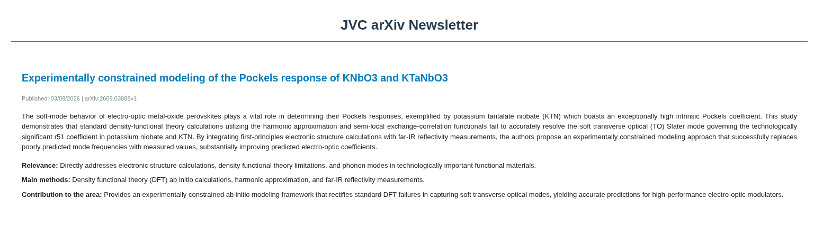

# 📬 Newsletter pessoal do arXiv

Uma das funções de um bom pesquisador é estar por dentro da literatura mais recente de sua área. Para isso, o **arXiv** é um repositório digital aberto
que guarda *preprints*, artigos antes de serem publicados (ou seja, sem revisão por pares).
Nesse contexto, cabe ao pesquisador todos os dias checar os trabalhos em andamento e filtrar diante da grande quantidade de papers submetidos aqueles que mais se identificam com sua grande área.

Em vista desse contexto criei uma ***Newsletter Pessoal*** que filtra os três artigos mais relevantes e recentes, publicados na categoria *cond-mat.mtrl-sci* do arXiv que mais se encaixa ao meu contexto de pesquisa. O pipeline é o seguinte:

~~~
1. Busca de papers candidatos (via wrapper python da API do arXiv)
    
                                 ⤋

2. Criação de uma query a ser embutida em prompt para modelo gemini-3.5-flash-lite

                                 ⤋

3. Filtra os 3 melhores com base em título, abstract e aderência a área (vide prompt) 

                                 ⤋

4. Envio de e-mail formatado em HTML
~~~

O resultado é um e-mail com os três artigos elencados, mostrando a relevância, os métodos principais e a contribuição para a área.

## 🛠️ Stack 

| Camada | Tecnologia | Propósito |
| :--- | :--- | :--- |
| **Linguagem** | `Python 3.10+` | Linguagem base com type hints modernos (`typing`). |
| **Inteligência Artificial** | `Google Gemini API`  | Análise semântica, ranqueamento e geração de resumos dos papers. |
| **Fonte de Dados** | `arXiv API` (`arxiv`) | Busca e coleta parametrizada de preprints científicos por categoria. |
| **Configuração**| `python-dotenv` | Gestão de variáveis de ambiente |
| **Envio de E-mail** | `smtplib` & `email.mime` (Standard Library) | Envio da newsletter formatada em HTML |
| **Processamento de Texto** | `re` (Standard Library) | Transformação do texto retornado pela API do Gemini. |
    
